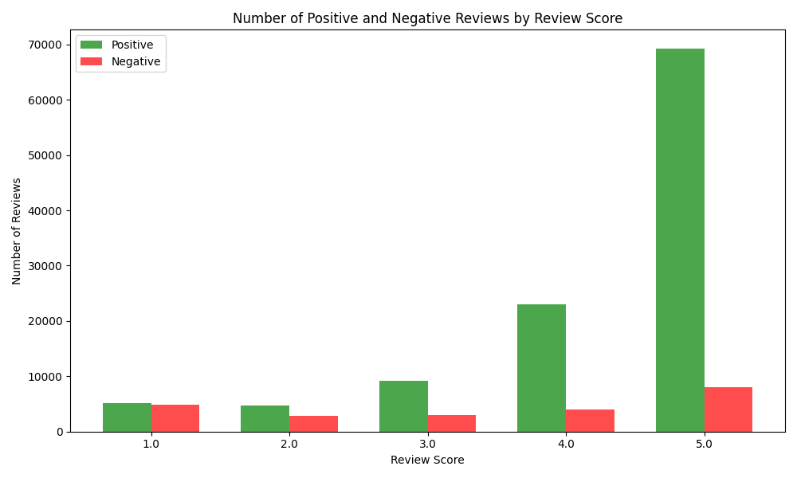
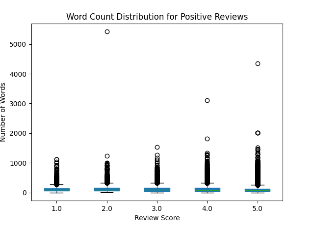
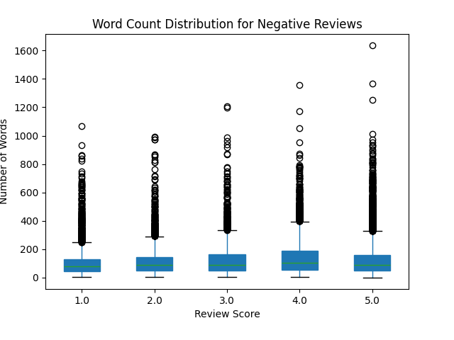

## Amazon Book Reviews Sentiment Analysis

## Description of the Problem.
This project analyzes Amazon book reviews to assess:
- The sentiment of the various comments
- The relationship between **review score** (1-5 stars) and textual content.
- The distribution of words in the comments by score.
  
---

## Need for Big Data and Cloud.
Processing large volumes of textual data is a complex process that requires scalable and reliable computational resources. Below are the reasons why **Big Data** and **Cloud** were used:

- **Big Data**: 
   - The use of **Apache Spark** is essential to process huge amounts of data efficiently. Spark, due to its distributed architecture, allows complex operations such as filters, transformations, and statistical calculations to be performed in reduced time even on large datasets.  
   - Spark's in-memory processing ensures high performance, especially for tasks such as **sentiment analysis** and **word count**.

- **Cloud**: 
   - **Scalability**: The cloud, through services such as **Google Cloud Storage (GCS)**, provides virtually unlimited storage capacity and computing power, allowing very large datasets to be processed without relying on local hardware.
   - **Flexibility**: Resources can be scaled according to project needs, ensuring optimized infrastructure utilization.
   - **Accessibility**: Storing data on GCS allows it to be accessed from any geographic location and facilitates integration with other cloud-based tools.
   - **Cost-Efficiency**: Unlike the initial investment required by physical infrastructure, the cloud allows you to pay only for resources actually used, reducing costs.
   - **Reliability**: Cloud services offer data redundancy, automatic backups and advanced security systems, ensuring that data is always accessible and protected.

Thanks to **Big Data** and the **Cloud**, it has been possible to:
- Store and manage datasets of over **2.7 GB**.
- Process data in a distributed and scalable manner.
- Achieve results in reasonable time, improving the efficiency of the entire workflow.


---

## Description of the Data
- **Origin**: Amazon Book Reviews Dataset.
- **Acquisition**: KAGGLE.
- **Details**:
  - `review/text`: Review text.
  - `review/score`: Review score.
- **Format**: CSV.
- **Size**: 2.7 GB.

## Description of the Application
### Flow of the Project.
1. **Cleaning and Table Creation**
   - **Script**: `review_title.py`
   - **Description**: Filters and cleans up the dataset.
   - **Motivation**: Separate to simplify future improvements.

2. **Analysis of Sentiment**
   - **Script**: `sentiment_text.py`
   - **Description**: Adds sentiment using **NLTK**.
   - **Problem**: Spark cluster limitations; data is stored on GCS.

3. **Word Count and Analysis**.
   - **Script**: `count_review.py`
   - **Description**: Calculates the number of words in reviews.
   - **Observation**:
   We expect that 
      - Reviews with 5 stars contain more words → Argumented satisfaction.
      - Reviews with 1-2 stars contain few words → Lack of detail.

## Script for plots
1. - **Script** `histogram_sentiment.py`
   - **Description** : Takes as input the directory created by *sentiment_text.py* and returns the plot (used locally) in our local envivronment
   - **Use**: 
   ```bash
   python istogramma_sentiment.py gs://esame-cloud/outputParaSentiment ./histogram_sentiment.png
   ```
   - **Observation**
   
   - The number of positive reviews (green bars) increases as the review score increases, with the highest number of positive reviews for 5-star ratings.
   - The number of negative reviews (red bars) decreases as the review score increases, indicating that books with higher ratings tend to receive fewer negative reviews.
   - This suggests that users tend to provide more detailed and argued feedback when they are satisfied with a product, while negative reviews are more concise.

2. - **Script** `boxplot_count.py`.
   - **Description** : Takes as input the directory created by *count_review* and returns a directory containing the boxplot for both negative and positive reviews.
   - **Use**
   ```bash
   python boxplot_count.py gs://esame-cloud/outputCount ./plots
   ```
   - **Observation**:
   

   - **Positive**
      - The number of positive reviews (green bars) increases as the review score increases, with the highest number of positive reviews for 5-star ratings.
      - The number of negative reviews (red bars) decreases as the review score increases, indicating that books with higher ratings tend to receive fewer negative reviews.

      - The number of negative reviews (red bars) decreases as the review score increases, indicating that books with a higher rating tend to receive fewer negative reviews.
      - This suggests that users tend to provide more detailed and argued feedback when they are satisfied with a product, while negative reviews are more concise.
      - The median number of words of negative reviews is lower than positive reviews, indicating that users tend to provide less detailed feedback for books they are dissatisfied with.
   - **Negative**
   

      - The upper quartile and outliers show that some users write longer negative reviews, but the general trend is toward shorter negative feedback.
      - The median number of words for positive reviews is higher than for negative reviews, suggesting that users provide more detailed and argued feedback when they are satisfied with a product.
      - The upper quartile and outliers show that many users write long positive reviews, further reinforcing the trend toward more comprehensive feedback for books with a high rating.

## Software Design
- **Architettura**: Progetto suddiviso in script modulari.
- **Libraries Used**:
   - Apache Spark: Used for distributed processing of large volumes of data.
   - NLTK: Employed for sentiment analysis and handling unstructured text.
   - PySpark SQL: Tool for efficient manipulation and management of structured data.
   - Google Cloud Storage: A scalable and secure data storage service, used as the primary repository for input and output.
   - GCSFS: Library used for efficient and transparent access to files stored on Google Cloud Storage through a file system interface.
   - Matplotlib: Utilized for data visualization and creating insightful charts and graphs.
   - Pandas: A powerful library for data manipulation, analysis, and transformation using DataFrames.
- **Depndencies**:
  - `pyspark`
  - `nltk`
  - `gcsfs`
  - `numpy`
  - `pandas`
  - `matplotlib`

- **Modularity**: Each script is independent for future improvements.

---

## Usage

### **1. Table Creation**.
To clean the dataset and prepare it for sentiment analysis, run the following command with **Google Cloud Dataproc**:

```bash
gcloud dataproc jobs submit pyspark \.
    --cluster mycluster \
    --region=europe-southwest1 \
    review_title.py \
    -- gs://exame-cloud/input/Books_rating.csv gs://exame-cloud/outputParaSentiment
```
### **2. Sentiment Analysis**
To perform sentiment analysis on the cleaned data, we use the following command:

```bash
spark-submit \
    --jars gcs-connector-hadoop3-latest.jar \.
    sentiment_text.py
spark-submit --jars gcs-connector-hadoop3-latest.jar sentiment_text.py
```
The above script was used in the absence of clusters due to issues regarding the use of the NLTK library, as each node on the clusters needed to have 
### **3. In-Depth Analysis of Reviews**
To calculate the number of words in reviews and analyze the relationship between **positive and negative comments** and the number of words used, we ran the following command on **Google Cloud Dataproc**:

```bash
gcloud dataproc jobs submit pyspark \
    --cluster mycluster \
    --region=europe-southwest1 \
    count_review.py \
    -- gs://exame-cloud/output gs://exame-cloud/outputCount
```

#### **Technical Choices and Problems Encountered**
During project development and implementation of sentiment analysis, we faced several difficulties that influenced the final choices:

1. **Problems with Spark NLP**:  
   Despite several attempts to integrate **Spark NLP** to optimize the sentiment analysis process, we ran into **compatibility problems between library versions**. This made a stable and working integration into the Dataproc clusters (momentarily) not possible.

2. **Limitations with NLTK**:  
   The use of the **NLTK** library revealed problems in handling dictionaries such as `vader_lexicon` within the Spark distributed environment on Dataproc. This prevented optimization of the process in the clusters.

3. **Temporary Solution**:  
   To overcome these obstacles, we opted for a more drastic solution:
   - The code for sentiment analysis was **executed manually**.
   - Data were read and written directly using **Google Cloud Storage (GCS)** as an intermediate input/output solution.

This solution, although not optimal, allowed us to complete the analysis and obtain valid results

---

## Performance Evaluation
During the execution of the project, we measured the impact of computational resources on processing performance:


### **Speed-Up with Number of vCPUs and Nodes**.
By increasing the number of **vCPUs** and nodes in the **Dataproc** cluster, we observed a significant reduction in execution time:

- **1 node, 2 vCPUs**: ---
- **2 nodes, 4 vCPUs**: ---  
- **4 nodes, 8 vCPUs**: ---  

The improvement is proportional to the increase in resources up to a certain point, beyond which a **coordination overhead** occurs between nodes.

### **Overheads Identified**.
- Management of **NLTK** (`vader_lexicon`) dictionaries introduced delays, especially when executed on multiple nodes.  
- **Spark NLP** was not used due to version incompatibilities, limiting optimization of sentiment analysis.

### **Optimizations Implemented**
- Use of **Google Cloud Storage (GCS)** for input/output, reducing load on local nodes.  
- Separation of **cleanup**, **sentiment analysis** and **word count** operations into modular scripts to simplify debugging and improve parallelism.

---

### **implementation challenges**
- **Compatibility between libraries** (e.g., Spark NLP and nltk).  
- Computational resource management for distributed processing on **Dataproc**.

---

## Conclusions.
The project partially achieved its main objectives by providing in-depth analysis of reviews and addressing significant challenges related to Big Data processing.


### **Goals Achieved**
- Cleaning and preparation of the dataset.  
- Sentiment analysis with integration of the **NLTK** library.  
- Relationship between **number of words** and review scores, with visual evidence via **graphs**.

### **Lessons Learned**
- The importance of **scalability** and optimal choice of computational resources.  
- Challenges in managing **libraries of NLP** in a distributed environment such as Spark.

### **Future Work**
- **Optimization**: Integrate **Spark NLP** or Transformer-based models to improve sentiment analysis performance.  
- **Extension**: Experiment with **topic modeling** to extract recurring themes from reviews.  
- **Advanced Visualization**: Integrate interactive dashboards for better data exploration and interpretation.

---

## References
1. [Apache Spark Documentation](https://spark.apache.org)  
2. [NLTK Documentation](https://www.nltk.org)  
3. [Google Cloud Storage](https://cloud.google.com/storage)  
4. [Dataset](https://www.kaggle.com/datasets/mohamedbakhet/amazon-books-reviews)
